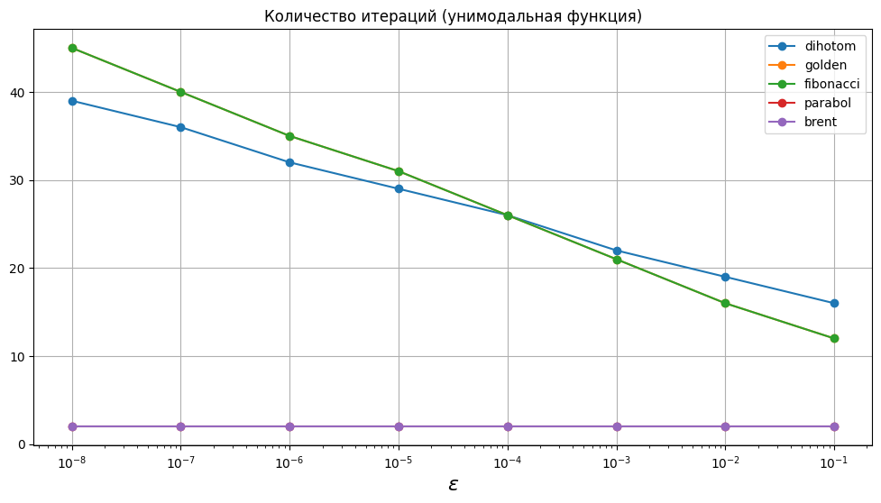
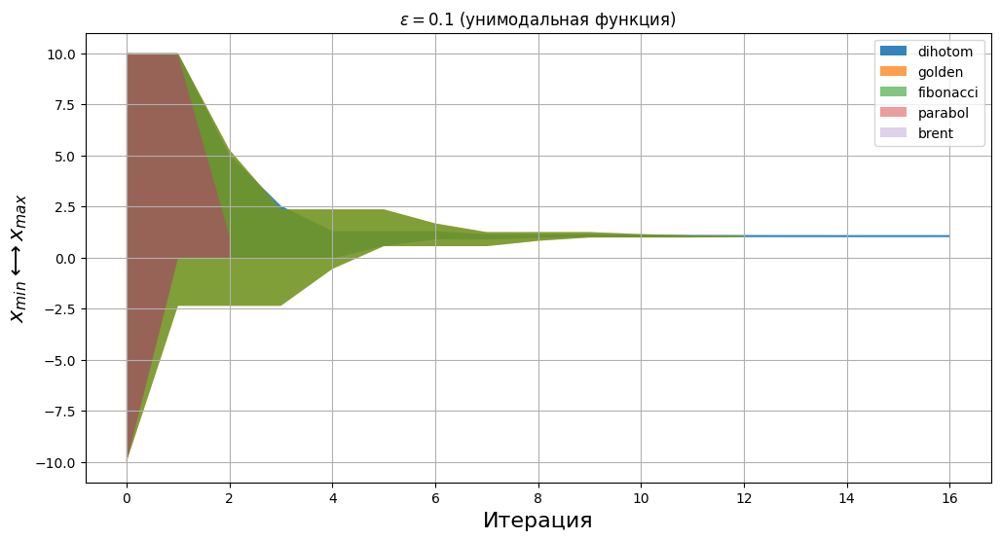
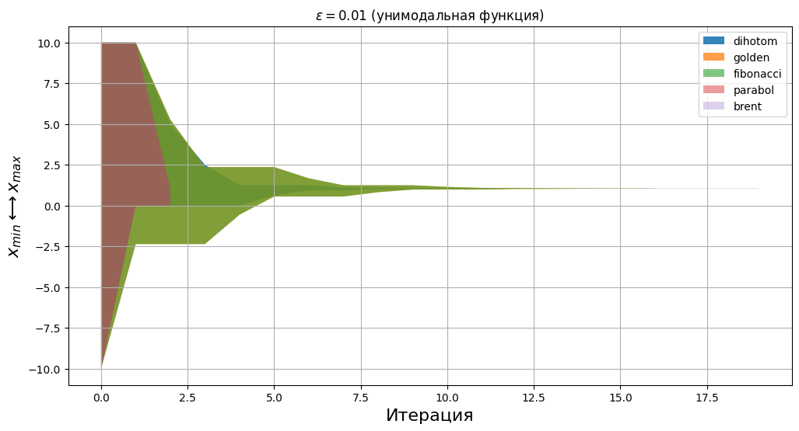
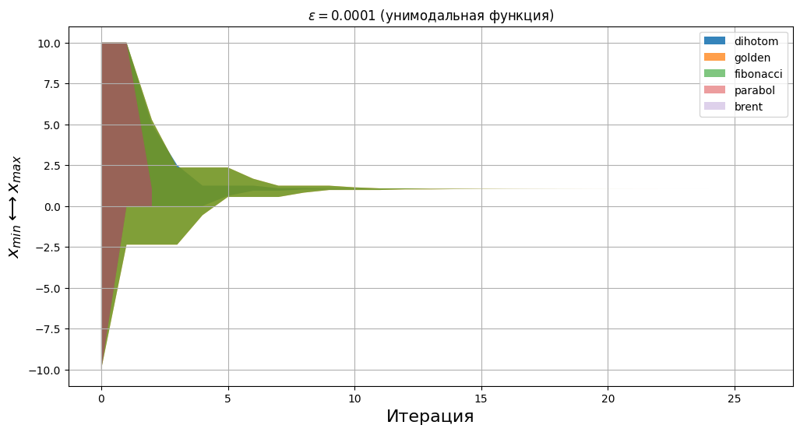
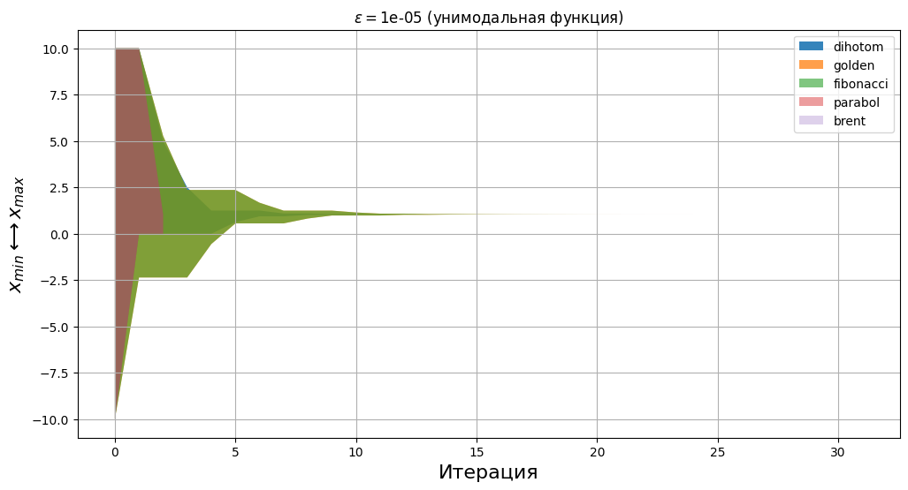
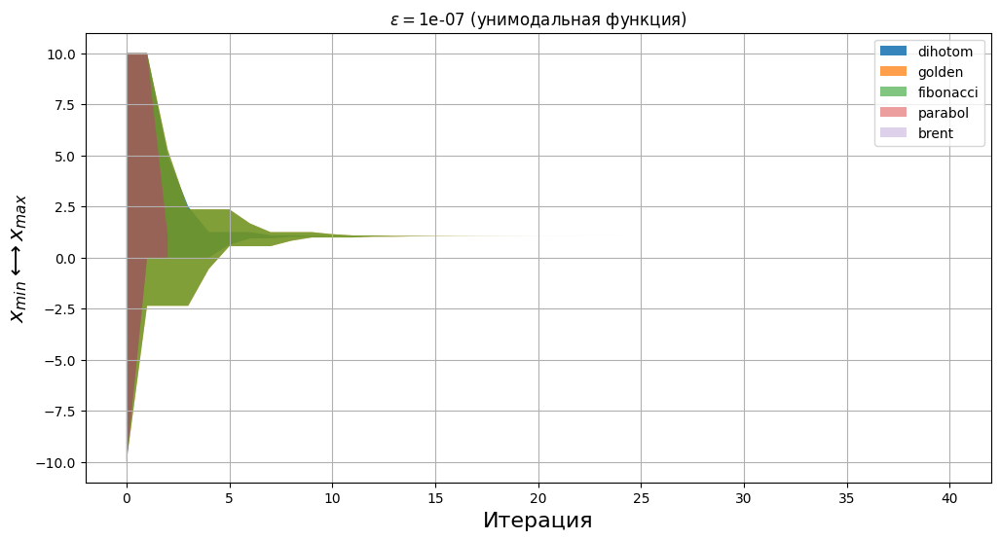
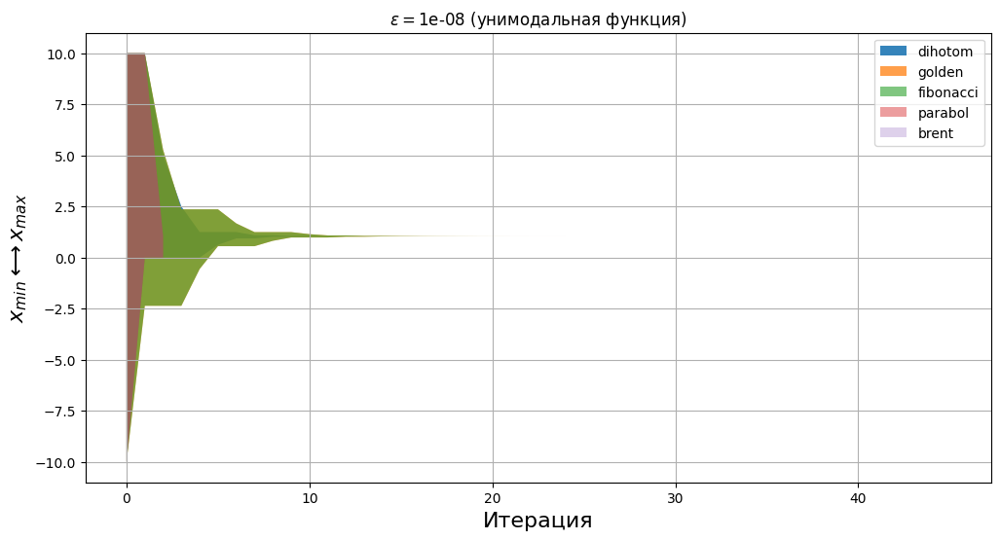
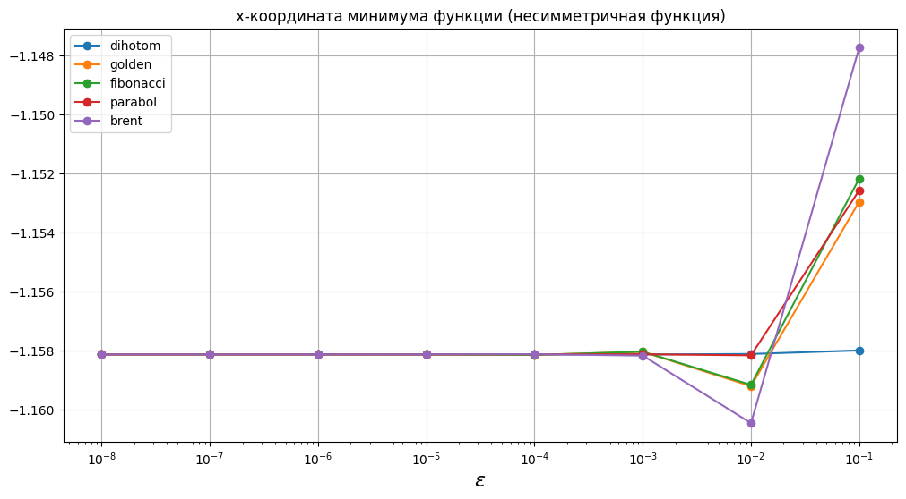
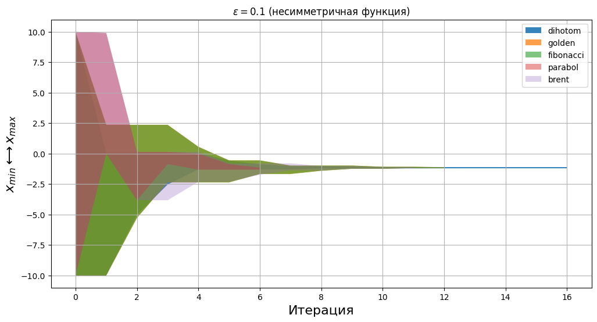

# Методы одномерного поиска

## Оптимизируемые модели
- "Хорошая" унимодальная функция с явно выраженным минимумом:

${f(x)=0.35 (x-1.05)^2 + 1}$.
- Унимодальная, но несимметричная относительно минимума функция, с участками плато или другими особенностями поведения:

${f(x)=0.4 x^2 + 2\sin(x) + 0.2\cos(2x+2)}$

- Многомодальная функция:

${f(x)=0.5 x^2 + 5\sin(x-4) + 0.5\cos(2x)}$

## Оптимизационные методы
- Метод пассивного поиска.
- Метод дихотомии.
- Метод золотого сечения.
- Метод Фибоначчи.
- Метод парабол.
- Комбинированный метод Брента (золотое сечение).

Расчеты приведены в блокноте [notebook.ipynb](notebook.ipynb)

## Минимизация унимодальной функции

### Динамика интервала неопределенности (унимодальная функция)

## Минимизация унимодальной, но несимметричной относительно минимума функции

### Динамика интервала неопределенности (унимодальная, но несимметричная функция)

## Минимизация многомодальной функции

С целью грубой оценки начального интервала неопределенности (предварительная разведка) использован метод пассивного поиска. Дальнейшая оптимизация выполнена методом золотого сечения. Полученный результат сравнен с применением этого метода без предварительной разведки.

## Приложение с таблицами

<!-- START_X_OPTIM_F_NONSYM --> 
### Таблица оптимальных значений (несимметричная функция)
|    eps |   dihotom |   golden |   fibonacci |   parabol |    brent |
|-------:|----------:|---------:|------------:|----------:|---------:|
| 0.1    |  -1.158   | -1.15295 |    -1.15216 |  -1.15256 | -1.14772 |
| 0.01   |  -1.15812 | -1.15921 |    -1.15917 |  -1.15816 | -1.16046 |
| 0.001  |  -1.15813 | -1.15805 |    -1.15804 |  -1.15813 | -1.15817 |
| 0.0001 |  -1.15813 | -1.15815 |    -1.15815 |  -1.15813 | -1.15813 |
| 1e-05  |  -1.15813 | -1.15813 |    -1.15813 |  -1.15813 | -1.15813 |
| 1e-06  |  -1.15813 | -1.15813 |    -1.15813 |  -1.15813 | -1.15813 |
| 1e-07  |  -1.15813 | -1.15813 |    -1.15813 |  -1.15813 | -1.15813 |
| 1e-08  |  -1.15813 | -1.15813 |    -1.15813 |  -1.15813 | -1.15813 |
<!-- END_X_OPTIM_F_NONSYM -->
<!-- START_ITER_COUNTER_F_NONSYM --> 
### Таблица количества итераций (несимметричная функция)
|    eps |   dihotom |   golden |   fibonacci |   parabol |   brent |
|-------:|----------:|---------:|------------:|----------:|--------:|
| 0.1    |        16 |       12 |          12 |         6 |      11 |
| 0.01   |        19 |       16 |          16 |         7 |      16 |
| 0.001  |        22 |       21 |          21 |         8 |      21 |
| 0.0001 |        26 |       26 |          26 |         8 |      26 |
| 1e-05  |        29 |       31 |          31 |         9 |      30 |
| 1e-06  |        32 |       35 |          35 |        10 |      35 |
| 1e-07  |        36 |       40 |          40 |        10 |      40 |
| 1e-08  |        39 |       45 |          45 |        11 |      45 |
<!-- END_ITER_COUNTER_F_NONSYM -->
<!-- START_FUNC_COUNTER_F_NONSYM --> 
### Таблица количества вычислений функции (несимметричная функция)
|    eps |   dihotom |   golden |   fibonacci |   parabol |   brent |
|-------:|----------:|---------:|------------:|----------:|--------:|
| 0.1    |        32 |       14 |          14 |         9 |      15 |
| 0.01   |        38 |       18 |          18 |        10 |      20 |
| 0.001  |        44 |       23 |          23 |        11 |      25 |
| 0.0001 |        52 |       28 |          28 |        11 |      30 |
| 1e-05  |        58 |       33 |          33 |        12 |      34 |
| 1e-06  |        64 |       37 |          37 |        13 |      39 |
| 1e-07  |        72 |       42 |          42 |        13 |      44 |
| 1e-08  |        78 |       47 |          47 |        14 |      49 |
<!-- END_FUNC_COUNTER_F_NONSYM -->

<!-- START_X_OPTIM_F_UNIMOD --> 
### Таблица оптимальных значений (унимодальная функция)
|    eps |   dihotom |   golden |   fibonacci |   parabol |   brent |
|-------:|----------:|---------:|------------:|----------:|--------:|
| 0.1    |   1.0499  |  1.05245 |     1.05197 |      1.05 |    1.05 |
| 0.01   |   1.04999 |  1.04965 |     1.04963 |      1.05 |    1.05 |
| 0.001  |   1.05    |  1.04981 |     1.0498  |      1.05 |    1.05 |
| 0.0001 |   1.05    |  1.05001 |     1.05001 |      1.05 |    1.05 |
| 1e-05  |   1.05    |  1.05    |     1.05    |      1.05 |    1.05 |
| 1e-06  |   1.05    |  1.05    |     1.05    |      1.05 |    1.05 |
| 1e-07  |   1.05    |  1.05    |     1.05    |      1.05 |    1.05 |
| 1e-08  |   1.05    |  1.05    |     1.05    |      1.05 |    1.05 |
<!-- END_X_OPTIM_F_UNIMOD -->
<!-- START_ITER_COUNTER_F_UNIMOD --> 
### Таблица количества итераций (унимодальная функция)
|    eps |   dihotom |   golden |   fibonacci |   parabol |   brent |
|-------:|----------:|---------:|------------:|----------:|--------:|
| 0.1    |        16 |       12 |          12 |         2 |       2 |
| 0.01   |        19 |       16 |          16 |         2 |       2 |
| 0.001  |        22 |       21 |          21 |         2 |       2 |
| 0.0001 |        26 |       26 |          26 |         2 |       2 |
| 1e-05  |        29 |       31 |          31 |         2 |       2 |
| 1e-06  |        32 |       35 |          35 |         2 |       2 |
| 1e-07  |        36 |       40 |          40 |         2 |       2 |
| 1e-08  |        39 |       45 |          45 |         2 |       2 |
<!-- END_ITER_COUNTER_F_UNIMOD -->
<!-- START_FUNC_COUNTER_F_UNIMOD --> 
### Таблица количества вычислений функции (унимодальная функция)
|    eps |   dihotom |   golden |   fibonacci |   parabol |   brent |
|-------:|----------:|---------:|------------:|----------:|--------:|
| 0.1    |        32 |       14 |          14 |         5 |       5 |
| 0.01   |        38 |       18 |          18 |         5 |       5 |
| 0.001  |        44 |       23 |          23 |         5 |       5 |
| 0.0001 |        52 |       28 |          28 |         5 |       5 |
| 1e-05  |        58 |       33 |          33 |         5 |       5 |
| 1e-06  |        64 |       37 |          37 |         5 |       5 |
| 1e-07  |        72 |       42 |          42 |         5 |       5 |
| 1e-08  |        78 |       47 |          47 |         5 |       5 |
<!-- END_FUNC_COUNTER_F_UNIMOD -->